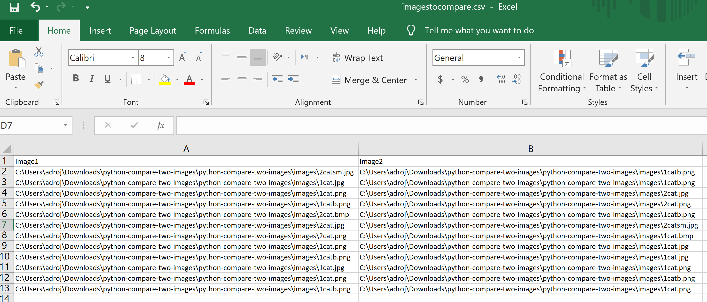
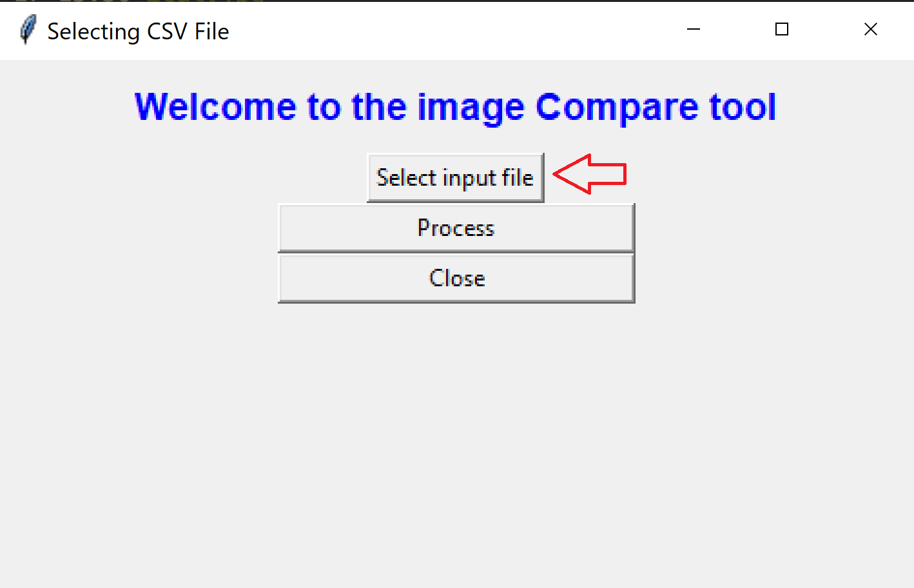

# Images similarity calculator Tool :robot:
This tool receives a CSV file as its main input to process a mathematical comparisson between images.
The CSV file must contain 2 columns (image1 and image2) with the corresponding file path of the images to compare per row.
The creation of the input CSV file is a manual process, the tool user will need to manually create it.
Once the images are compared, the output of the tool will be a Results.csv file which will return the comparison analysis of the images pairs included in the input CSV file.


## Preparation steps
:heavy_check_mark: Download/Clone this repository to your local git environment. :octocat:

:heavy_check_mark: The folder :file_folder: [**/images**](/images) contains sample images :framed_picture: , that can be used as test images to test the tool.

:heavy_check_mark: **Create your Input CSV file:** Check the real path of the images to compare, and create a csv file with 2 columns: image1 and image2, please keep this header exactly as it is, just update the images path based on the the examples csv files your will find in this repository  [*images_to_compare.csv*](images_to_compare.csv ) and [*imagestocompare.csv*](imagestocompare.csv) and update the CSV file.



:heavy_check_mark: You can run the tool using a graphical interface [**tk_gui.py**](https://github.com/nanarojas/Image-Comparison-Tool-Adris#running-the-tk-gui-version) or if you feel like typing in your command line :nerd_face: you can use [**cli.py**](https://github.com/nanarojas/Image-Comparison-Tool-Adris#running-the-cli-version).
## Project structure
A library `image_diff_score.py` contains the functionality for parsing
CSV files, opening images and comparing them providing the score
The library is used by `tk_gui.py` and `cli.py`, depending on how the user
wants to use the application.

## Testing
The [***Dockerfile***](Dockerfile) contains a [***test.sh***](test.sh) script that will invoke the cli.py and
validate that the results are the ones we have been expecting.
By Having it as part of the docker build process it won't be possible to build an
image if the code does not behave properly.

Docker images can be built from this utility and provided to registries such as dockerhub/etc.

## Running locally

### Creating a virtual Environment

It is suggested to create a virtual environment to avoid installing packages
of potentially incompatible versions system-wide.
```
$ apt-get install python3-venv
$ python3 -m venv venv
$ source ./venv/bin/activate.fish
$ pip install -r requirements.txt
```

### Running the TK GUI version

```
$ ./tk_gui.py
```
The GUI version allow you to open directories in your Windows/Mac to select the input CSV file and once the
input file is selected the data can be processed.


### Running the CLI version
The CLI version can be used from Windows PowerShell or a Linux terminal, just need to be in the same directory as the
other files of this document.


```
$ ./cli.py --help
Usage: cli.py [OPTIONS]

  Processes the input file and writes the results to the chosen output

Options:
  --input_filename TEXT   The name of the file to process
  --output_filename TEXT  The name of the file to write results to
  --help                  Show this message and exit.
```


## Running in docker


### Building the docker image :whale2:	
```
$ docker build -t adriana:0.0.1 .
```

### Running
```
$ cat input.csv
filePath1,filePath2
/input/file1.png,/input/file2.bmp
$ docker run -v $PWD/images_to_compare.csv:/input/images_to_compare.csv -v $PWD/results/:/output/results.txt --rm adri:0.0.1 --input_filename /input/im
ages_to_compare.csv --output_filename /output/results.csv
                   Image1                 Image2
0  /sre/images/2catsm.jpg  /sre/images/1catb.png
1    /sre/images/1cat.jpg  /sre/images/1catb.png
2    /sre/images/1cat.png   /sre/images/2cat.jpg
3   /sre/images/1catb.png   /sre/images/2cat.png
4    /sre/images/2cat.bmp  /sre/images/1catb.png
7076.6557782491045 0.3601432853297968 0.023279190063476562
0.01763153076171875 0.00015812198054721005 0.025079011917114258
7113.018145243327 0.34686864650177485 0.03287339210510254
7152.29151280721 0.3466652812582133 0.029982328414916992
7152.29151280721 0.3466652812582133 0.017601966857910156
96.01134618123372 0.06636203054023837 0.019517183303833008
7152.29151280721 0.3466652812582133 0.016609668731689453
0.01763153076171875 0.00015812198054721005 0.02214193344116211
0.01763153076171875 0.00015812198054721005 0.022501468658447266
0.01763153076171875 0.00015812198054721005 0.022220134735107422
0.0 0.0 0.031219005584716797
0.0 0.0 0.03145885467529297
```


### Understanding the results:
- Based on the business requirement the output file of this tool will be a CSV file with 4 Columns:

 -- **Image1** 
 
 -- **Image2**
 
 -- **similar**
 
 -- **elapsed**
 

- The first 2 columns will be the same as the image paths provided in the input CSV file.
- **similar column:** The third column contains the actual result of our analysis, the score calculated is based on 0, meaning 2 equal images will have a score of 0, the higher the deviation, the larger the difference.
- **elapsed:** The 4th column will provide the computational time taken for each pair of images to be compared, this result is in fraction of seconds.


### Considerations

- :octocat: Before running this tool, please make sure you have the latest version, please update your local repository to download the most updated version of the tool. :octocat:
- The most important dependency of this tool is its input file, if the user uploads bad data the computational won't work.  For troubleshooting please validate that the input file has the same column names as indicated in the Preparation steps, and that each image path is valid.
- The file names expected by the scripts are expected to be full paths, so the input files need to be aware of the docker filesystem context in which they run, for example, if I plan to mount the input file in /input then the CSV file should contain /input as the root, see Running example above.
